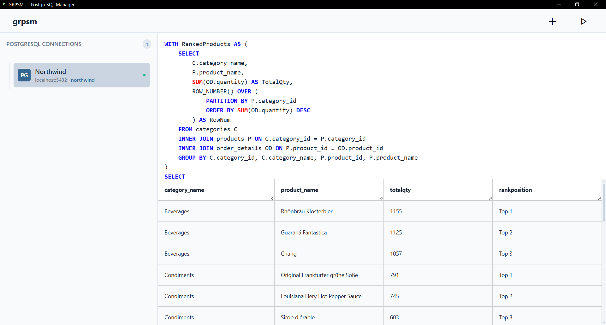

# GRPSM - Graphical PostgreSQL Manager

### A lightweight, fast, and secure desktop GUI client for PostgreSQL databases.

[](https://www.rust-lang.org/)
[](https://tauri.app/)
[](https://reactjs.org/)
[](https://www.typescriptlang.org/)
[](https://www.postgresql.org/)

<br />

[](https://github.com/gemushka-dev/grpsm/releases/download/v1.0.0/GRPSM1.0.0.x64.msi)

---

## Preview

<div align="center">
  
</div>

---

## Features

- Blazing Fast & Lightweight: Unlike heavy Electron-based tools, GRPSM weighs `~15 MB` and consumes minimal RAM.
- Secure by Design: Credentials and connection strings are managed entirely within compiled Rust code, keeping your data safe.
- Dynamic Table Rendering: Automatically generates clean HTML tables for any custom `SELECT` query results.
- Persistent Connection Pool: Powered by Rust's async runtime, keeping database connections alive without needing to reconnect on every query.

---

## Tech Stack

- Rust
- Tauri
- React-ts
- PostgreSQL

## Getting Started (Development)

### Prerequisites

- [Node.js](https://nodejs.org/) (v18 or higher)
- [Rust Toolchain](https://www.rust-lang.org/tools/install) (Stable)

### Installation & Run

1. Clone the repository:
   ```bash
   git clone
   cd grpsm
   ```
